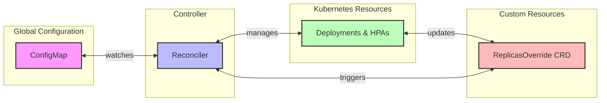

# KubeDynamicScaler

<div align="center">


[](https://goreportcard.com/report/github.com/KubeDynamicScaler/KubeDynamicScaler)
[](https://opensource.org/licenses/Apache-2.0)
[](https://github.com/KubeDynamicScaler/kubedynamicscaler/releases/latest)

</div>

> ⚠️ **IMPORTANT DISCLAIMER**: This project is currently under active development and is not yet ready for production use. Features may be incomplete, and breaking changes can occur without notice. We recommend using it only for testing and development purposes until a stable release is announced.

KubeDynamicScaler is an open-source Kubernetes controller that revolutionizes how you manage deployment replicas in your clusters. It provides an elegant, Kubernetes-native solution for centralized workload management, replacing traditional scripts and cronjobs used by cluster administrators for mass scaling operations.

Whether you're preparing for Black Friday, performing cluster maintenance, or implementing multi-cluster load balancing, KubeDynamicScaler offers a flexible, dynamic, and automated way to control application scaling through global configurations and specific overrides, while maintaining safety through exclusion rules.

### What KubeDynamicScaler is NOT

KubeDynamicScaler is not a resource optimization tool. It does not compete with solutions like ScaleOps, Perfect Scale, VPA (Vertical Pod Autoscaler), Karpenter, or other automatic resource optimizers. While these tools focus on continuously analyzing and optimizing resource usage based on metrics and patterns, KubeDynamicScaler is specifically designed for controlled, intentional scaling operations.

## 🌟 Key Features

- **Global Replica Management**: Define cluster-wide scaling policies
- **Selective Overrides**: Apply specific scaling rules to targeted deployments
- **HPA/KEDA Integration**: Seamlessly work with existing auto-scaling solutions
- **Flexible Scaling Modes**: 
  - Global Mode: Defines a percentage for a global adjustment of replicas (can be to increase or to reduce)
  - Override Mode: Handle percentual override to workloads, selector or namespaces specified
  - Additive Mode: Stack percentages to be added to the overall percentage
  - Ignore Mode: Handle exceptions to workloads, selector or namespaces specified
- **Real-time Updates**: Configuration changes through ConfigMaps without restarts
- **Prometheus Metrics**: Built-in monitoring and alerting support
- **Kubernetes Native**: Follows Kubernetes patterns and best practices

## 🎯 Why KubeDynamicScaler?

KubeDynamicScaler addresses common challenges in Kubernetes deployments by providing a Kubernetes-native solution for scenarios that are typically managed through custom scripts and cronjobs. Unlike resource optimization tools that focus on continuous resource usage analysis, KubeDynamicScaler is designed for planned, intentional scaling operations:

- **Centralized Management**: Replace scattered scripts and cronjobs with a unified, Kubernetes-native solution
- **Cost Optimization**: Automatically adjust replicas based on global policies without manual intervention
- **Scheduled Events**: Seamlessly prepare workloads for high-traffic events like Black Friday, Cyber Monday, or Marketing Campaigns
- **Resource Efficiency**: Fine-tune scaling based on actual needs with built-in safety mechanisms
- **Enterprise Ready**: Production-tested with monitoring and safety features, eliminating the need for custom maintenance scripts
- **Flexible Control**: Choose exactly which workloads to scale or exclude from scaling through declarative configurations
- **Granular Management**: Fine-tune scaling behavior for different environments and workloads with Kubernetes-native controls

## 🚀 Quick Start

### Prerequisites

- Kubernetes cluster (v1.24+)
- kubectl
- Helm v3 (optional)

### Installation

#### Using Helm (Recommended)

```bash
# Add the Helm repository
helm repo add kubedynamicscaler https://kubedynamicscaler.github.io/charts
helm repo update

# Install the controller
helm install kubedynamicscaler kubedynamicscaler/kubedynamicscaler \
  -n kubedynamicscaler-system \
  --create-namespace
```

#### Using kubectl

```bash
# Apply the manifests directly
kubectl apply -f https://raw.githubusercontent.com/KubeDynamicScaler/kubedynamicscaler/main/deploy/manifests.yaml
```

### Verify Installation

```bash
# Check if the controller is running
kubectl get pods -n kubedynamicscaler-system

# Check if CRDs are installed
kubectl get crd | grep kubedynamicscaler
```

### Basic Usage

1. Create a global configuration for Black Friday preparation:

```yaml
apiVersion: v1
kind: ConfigMap
metadata:
  name: kubedynamicscaler-config
  namespace: kubedynamicscaler-system
data:
  config.yaml: |
    # Scale all workloads to 200% for Black Friday
    globalPercentage: 200
    # Ensure we don't exceed cluster capacity
    maxReplicas: 600
    # Keep at least one replica for each workload
    minReplicas: 2
```

2. Create a configuration for cluster split (e.g., load balancing multi-cluster ):

```yaml
apiVersion: v1
kind: ConfigMap
metadata:
  name: kubedynamicscaler-config
  namespace: kubedynamicscaler-system
data:
  config.yaml: |
    # Scale down to 50% to prepare for cluster split
    globalPercentage: 50
    maxReplicas: 600
    minReplicas: 2
```

3. Create overrides for specific workloads:

```yaml
# Example 1: Scale frontend services by label selector
apiVersion: kubedynamicscaler.io/v1
kind: ReplicasOverride
metadata:
  name: critical-backend-scale
spec:
  # Target all deployments with these labels
  selector:
    matchLabels:
      workload: critical
      tier: backend
  # Override mode replaces the global percentage
  overrideType: override
  # Scale to 150% of original replicas
  replicasPercentage: 150

---
# Example 2: Scale a specific deployment directly
apiVersion: kubedynamicscaler.io/v1
kind: ReplicasOverride
metadata:
  name: catalog-service
spec:
  # Direct reference to a specific deployment
  deploymentRef:
    name: catalog-service
    namespace: backend
  # Additive mode adds to the global percentage
  overrideType: additive
  # Add 50% more replicas on top of global percentage
  replicasPercentage: 150

---
# Example 3: Scale an HPA-managed workload
apiVersion: kubedynamicscaler.io/v1
kind: ReplicasOverride
metadata:
  name: catalog-database-scale
spec:
  # Reference to a specific HPA
  hpaRef:
    name: catalog-database-hpa
    namespace: backend
  overrideType: override
  # Scale to 200% of original replicas
  replicasPercentage: 200
```

4. Create ignore rules for specific workloads:

```yaml
# Example: Define workloads to exclude from scaling
apiVersion: kubedynamicscaler.io/v1
kind: GlobalReplicasIgnore
metadata:
  name: exclude-workloads
spec:
  # Exclude deployments with specific labels
  ignoreLabels:
    environment: staging
    workload: test
  # Exclude specific namespaces
  ignoreNamespaces:
    - development
    - testing
  # Exclude specific resources
  ignoreResources:
    - kind: Deployment
      name: staging-api
      namespace: development
    - kind: Deployment
      name: test-database
      namespace: testing
```

Each example demonstrates a different use case:
- Global scaling for events like Black Friday or cluster maintenance
- Label-based scaling for groups of related services
- Direct deployment scaling for specific workloads
- HPA integration for auto-scaling workloads
- Flexible workload exclusion rules

The controller will automatically handle the scaling while respecting:
- Original replica counts
- HPA configurations
- Minimum and maximum replica limits
- Cluster capacity constraints
- Workload exclusion rules


In this example, the global policy of 150% automatically increases the number of replicas in a new deployment from 4 to 6.
Then, a 50% override is applied to that specific deployment, reducing the number of replicas from the original 4 to just 2.


In this example, we created a deployment with 4 replicas, but it initially scaled to 6 replicas due to the global policy of 150%. Then, we applied a selector-based override (using a label) with a value of 300%, which increased the number of replicas from the original 4 to 12.


## 🏗️ Architecture

KubeDynamicScaler follows a modular architecture:



The controller watches for:
- Changes in the global ConfigMap
- ReplicasOverride CRD instances
- Deployment and HPA changes

## 🌟 Key Features

### 1. Global Replica Management
- Define cluster-wide scaling policies
- Perfect for events like Black Friday or maintenance windows
- Respects cluster capacity and resource limits

### 2. Selective Overrides
- Target specific deployments by labels or direct reference
- Support for both override and additive scaling modes
- Works seamlessly with existing HPA configurations
- Fine-grained control over which workloads to scale

### 3. Safety Features
- Automatic backup of original replica counts
- Respect for minimum and maximum replica limits
- Protection against accidental scaling
- Integration with Kubernetes RBAC
- Flexible workload exclusion rules
- System namespace protection

### 4. Monitoring & Observability
- Built-in Prometheus metrics
- Detailed status reporting
- Audit trail of scaling operations

## 🤝 Contributing

We welcome contributions! Here's how you can help:

1. **Report Bugs**
   - Use the GitHub issue tracker
   - Include detailed steps to reproduce
   - Add logs and error messages

2. **Suggest Features**
   - Create a feature request issue
   - Explain the use case and benefits
   - Consider implementation complexity

3. **Submit Pull Requests**
   - Fork the repository
   - Create a feature branch
   - Add tests for new functionality
   - Update documentation
   - Follow our coding standards

4. **Improve Documentation**
   - Fix typos and clarify explanations
   - Add more examples
   - Improve formatting

### Development Setup

```bash
# Clone the repository
git clone https://github.com/KubeDynamicScaler/kubedynamicscaler.git
cd kubedynamicscaler

# Install dependencies
make install

# Run tests
make test

# Build the controller
make docker-build IMG=kubedynamicscaler:latest
```

## 📚 Documentation

Visit our [official documentation](https://kubedynamicscaler.io/docs) for:

- [Architecture Overview](https://kubedynamicscaler.io/docs/architecture)
- [Installation Guide](https://kubedynamicscaler.io/docs/installation)
- [Configuration Reference](https://kubedynamicscaler.io/docs/configuration)
- [Best Practices](https://kubedynamicscaler.io/docs/best-practices)
- [Troubleshooting](https://kubedynamicscaler.io/docs/troubleshooting)

## 📅 Roadmap

See our [GitHub Project Board](https://github.com/KubeDynamicScaler/kubedynamicscaler/projects/1) for planned features and enhancements.

Upcoming features:
- [ ] Custom scaling algorithms
- [ ] Time-based scaling rules
- [ ] Integration with external metrics
- [ ] Webhook support for scaling events
- [ ] Multi-cluster support

## 📫 Community & Support

- [GitHub Discussions](https://github.com/KubeDynamicScaler/kubedynamicscaler/discussions)
- [Slack Channel](https://kubedynamicscaler.slack.com)
- [Twitter](https://twitter.com/kubedynamicscaler)

## 📜 License

KubeDynamicScaler is licensed under the Apache License 2.0 - see the [LICENSE](LICENSE) file for details.

## 🌟 Acknowledgments

Special thanks to:
- All our contributors
- Companies using and supporting KubeDynamicScaler
- The Kubernetes community for inspiration and tools

